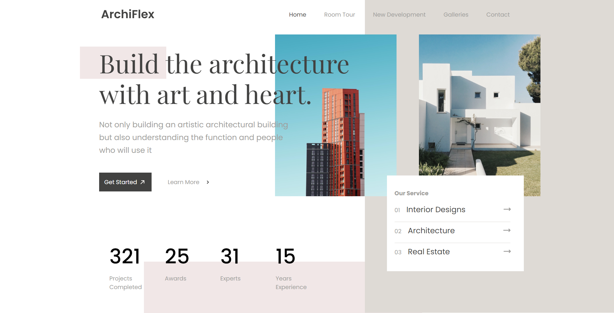

## ESP:

# Header Architecture (No responsive) 💅👧

Maquetación de un header para un sitio web de una empresa de arquitectura

## 🎯 Objetivo del Proyecto

El objetivo de este proyecto es aplicar todo lo aprendido en HTML y CSS utilizando el preprocesador SASS

## 👁️ Vista previa del proyecto




## 🛠️ Estructura del Proyecto

El proyecto está organizado en varias carpetas y archivos para facilitar su mantenimiento y expansión:

Una carpeta **img** con todas las imagenes utilizadas en la maquetación

Una carpeta **sass** donde se aplican todos los estilos de forma organizada y estructurada

Una carpeta **css** donde en el style.css se compila todo lo hecho en sass

Un archivo **index.html** con toda la estructura html del header


## 🚀 Funcionalidades y uso

Podrás usar la página pinchando en el siguiente enlace gracias a Github Pages:

https://kaeedev.github.io/Proyecto-7-Spa-Beauty/

## 🛠️ Instalación y Ejecución

1. Clona este repositorio:
   ```bash
   https://github.com/kaeedev/Proyecto-8-Header-Architecture.git

2. No requiere de instalación. Con la extensión live server o similares de VSCODE podrás ver el proyecto de manera local

## 📝 Licencia

Este proyecto está disponible únicamente para uso **docente** y con fines de aprendizaje.

### Condiciones:
- El código fuente de este proyecto puede ser usado, modificado y distribuido solo con fines educativos.

Si tienes alguna duda o quieres utilizar algún recurso de este proyecto, por favor contacta conmigo.

---
## ENG

# Header Architecture (No responsive) 💅👧

Layout of a Header for a Architecture company

## 🎯 Project Objective

The objective of this project is to apply what I've learned in HTML and CSS, using the SASS preprocessor to create an attractive and functional header.

## 👁️ Project Preview


## 🛠️ Project Structure

The project is organized as follows:

img/: Contains all images used in the layout.

sass/: Contains SASS files with organized styles.

css/: Here, all SASS code is compiled into a single file, style.css.

index.html: The main file containing the HTML structure of the header.

## 🚀 Features and Usage

You can explore the page at the following link, thanks to GitHub Pages:

https://kaeedev.github.io/Proyecto-7-Spa-Beauty/

## 🛠️ Installation and Execution

- Clone this repository:
  ```bash
  https://github.com/kaeedev/Proyecto-8-Header-Architecture.git
  
- No installation is required. You can use the Live Server extension or similar in VS Code to view the project locally.
  
## 📝 License

This project is available solely for educational use and for learning purposes.

### Conditions:

The source code of this project can be used, modified, and distributed only for educational purposes.
If you have any questions or wish to use any resources from this project, please contact me.
